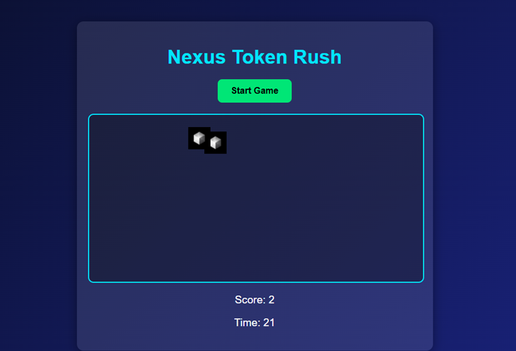

# 🎮 Nexus Token Rush

Game mini sederhana untuk promosi [Nexus](https://app.nexus.xyz/).  
Klik & kumpulin token Nexus sebanyak mungkin dalam **30 detik**!  
Setelah waktu habis → langsung bisa menuju app resmi Nexus 🚀  

---

## 🏷️ Badges
  
  
  
  

---

## 🔗 Mainkan Game
👉 [Klik di sini untuk bermain](https://omuwo.github.io/nexus-token-rush/)  

---

## 📸 Preview

---

## 📂 Struktur File
- `index.html` → halaman utama game  
- `style.css` → desain tampilan  
- `script.js` → logika game  
- `logo-nexus.png` → logo token yang muncul di game  
- `favicon.png` / `favicon-32.png` → ikon browser tab  
- `nexus_token_rush_preview.png` → screenshot preview untuk promosi  

---

## 🚀 Cara Deploy ke GitHub Pages
1. Buat repo baru di GitHub.  
2. Upload semua file di atas.  
3. Masuk ke **Settings → Pages**.  
4. Pilih **Deploy from a branch** → branch: `main` → folder: `/ (root)`.  
5. Simpan → tunggu ±1 menit → game siap dimainkan di:  

---

## ⚠️ Disclaimer
This mini-game is a **fan-made project** created only for fun and as a demo of a simple browser game.  
It is **not an official product** of [Nexus](https://app.nexus.xyz/) and is not affiliated with the Nexus team in any way.  

Play responsibly and enjoy! 🚀  
